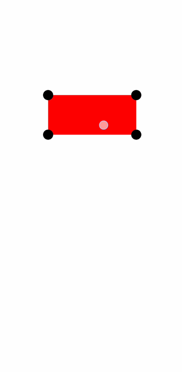

# @shamilkotta/rn-drag-resize

Draggable and Resizable component using React Native Reanimated

This library is a fork of [reanimated-drag-resize](https://github.com/fateh999/reanimated-drag-resize).

- [x] Event start and end callbacks
- [x] 4 corner resizing



## Getting started

Install the library:

```bash
pnpm add @shamilkotta/rn-drag-resize
```

## Required peer dependencies

|          dependency          | required version |
| :--------------------------: | :--------------: |
|   react-native-reanimated    |    \>= 2.0.0     |
| react-native-gesture-handler |      \>= \*      |

## Usage

Example app can be found [here](https://github.com/shamilkotta/rn-drag-resize/tree/main/example)


```javascript
import DragResizable from '@shamilkotta/rn-drag-resize';
```

## Example

```jsx
import DragResizable from '@shamilkotta/rn-drag-resize';

...
const [bounds, setBounds] = useState({ width: 0, height: 0 });

...
  <SafeAreaView style={styles.container}>
    <View
      onLayout={(ev) => {
        const layout = ev.nativeEvent.layout;
        setBounds({ width: layout.width, height: layout.height });
      }}
      style={styles.container}
    >
      <DragResizable
        heightBound={bounds.height}
        widthBound={bounds.width}
        left={10}
        top={10}
      >
        <View style={styles.box} />
      </DragResizable>
    </View>
  </SafeAreaView>
...

  const styles = StyleSheet.create({
    container: {
      height: "100%",
    },
    box: {
      backgroundColor: "red",
      width: "100%",
      height: "100%",
    },
  });
```

## Props

#### Options

| name           | type            | description                                 | default                                                |
| -------------- | --------------- | ------------------------------------------- | ------------------------------------------------------ |
| isDraggable    | boolean         | Can be used to enable or disable the drag   | true                                                   |
| isResizable    | boolean         | Can be used to enable or disable the resize | true                                                   |
| top            | number          | Top position of the box                     | -                                                      |
| left           | number          | Left position of the box                    | -                                                      |
| minWidth       | number          | Minimum width limit for resize              | 50                                                     |
| minHeight      | number          | Minimum height limit for resize             | 50                                                     |
| heightBound    | number          | Y axis boundary for drag                    | -                                                      |
| widthBound     | number          | X axis boundary for drag                    | -                                                      |
| height         | number          | Height of the box                           | 50                                                     |
| width          | number          | Width of the box                            | 150                                                    |
| scale          | number          | Resize or drag factor                       | 1                                                      |
| resizeHandlers | Array<Handlers> | Visible resize handlers                     | `['bottomLeft', 'bottomRight', 'topLeft', 'topRight']` |
| renderHandler  | ReactNode       | Handler component                           | -                                                      |
| style          | ViewStyle       | Box style                                   | -                                                      |

#### Callbacks

| name          | description                               | params       | expected return |
| ------------- | ----------------------------------------- | ------------ | --------------- |
| onDragStart   | Will be called when the drag starts       | -            | void            |
| onDragEnd     | Will be called at the end of drag         | BoxDimension | void            |
| onResizeStart | Will be called when the resize starts     | -            | void            |
| onResizeEnd   | Will be called at the end of drag         | BoxDimension | void            |
| onTap         | Will be called, when user taps on the box | -            | void            |

## Contributing

See the [contributing guide](CONTRIBUTING.md) to learn how to contribute to the repository and the development workflow.

## License

[MIT](LICENSE)

---

Made with [create-react-native-library](https://github.com/callstack/react-native-builder-bob)
